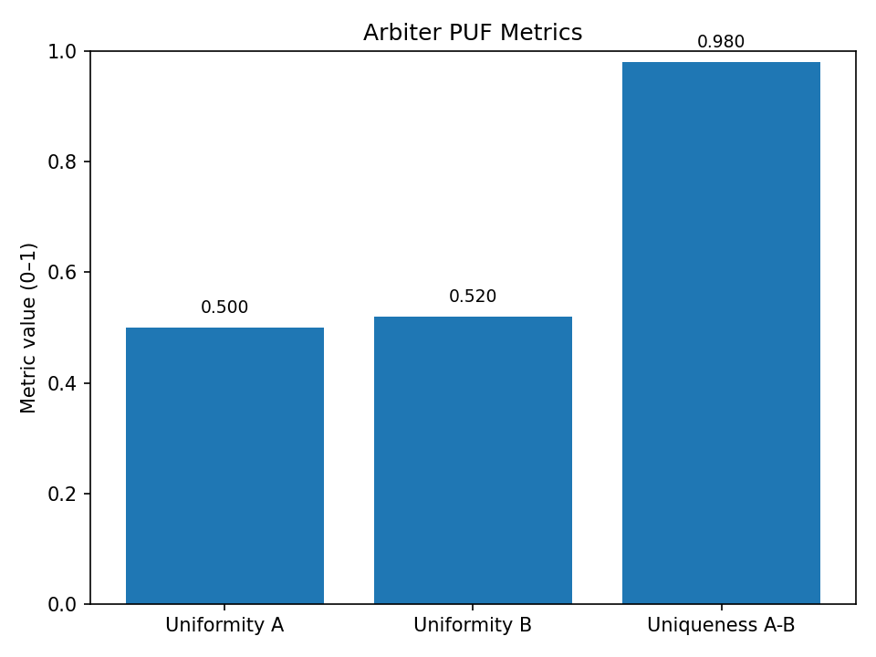

Arbiter PUF on Nexys A7
Introduction

A Physically Unclonable Function (PUF) is a hardware primitive that leverages small, random manufacturing variations in silicon to create a unique digital “fingerprint.” Unlike stored secret keys that can be extracted or cloned, a PUF generates secrets on demand, making it useful for hardware security, authentication, and anti-counterfeiting.
This project implements an Arbiter PUF on the Digilent Nexys A7 (Artix-7) FPGA to show how delay-based circuits can generate stable yet unique challenge–response pairs (CRPs), suitable for device identification and key generation.

Why Use a PUF?

No two chips produce the same responses, even when fabricated from the same design. The circuits require minimal hardware resources compared to secure NVM or cryptographic accelerators, and since keys are generated only when needed, nothing must be permanently stored.

Project Overview

The design targets the Nexys A7-100T FPGA and implements an Arbiter PUF with configurable stages. A UART interface is provided to stream challenge–response pairs to a host PC. Supporting Python scripts collect CRPs and evaluate metrics such as uniqueness, reliability, and uniformity. Internally, the Arbiter PUF consists of a chain of multiplexers. Two signals race through slightly different paths, and an arbiter latch outputs a response bit depending on which path arrives first. Repeating this for many challenges produces a CRP dataset unique to each board.

Repository Layout

hw/ – top module and constraints

rtl/ – Arbiter PUF core and supporting logic (UART, LFSR)

sim/ – testbenches and delay line simulation

scripts/ – Python scripts for collection and metric analysis

docs/ – example CRP data and results

Prerequisites

Vivado 2023.2 (or later) and Python 3.8+ with pyserial, numpy, and matplotlib.

Build and Run

In Vivado, create a project, add the RTL (rtl/*.v) and top module (hw/top.v), apply the constraints (hw/nexys_a7_example.xdc), then run synthesis, implementation, and bitstream generation before programming the Nexys A7 board.
Once programmed, connect UART at 115200 8N1 and run python3 scripts/collect_uart.py > chipA.csv. Repeat on another board or after power cycling to compare results. Metrics can then be computed using python3 scripts/puf_metrics.py chipA.csv chipB.csv.

Results

The analysis reports uniqueness (differences across chips, ideally ~50%), reliability (stability across runs of the same chip, ideally >95%), and uniformity (balance between 0s and 1s, ideally ~50%). An example run produced:

Applications
### Results Visualization

Typical applications include device authentication, secure key generation, counterfeit detection, and other lightweight cryptographic building blocks.
